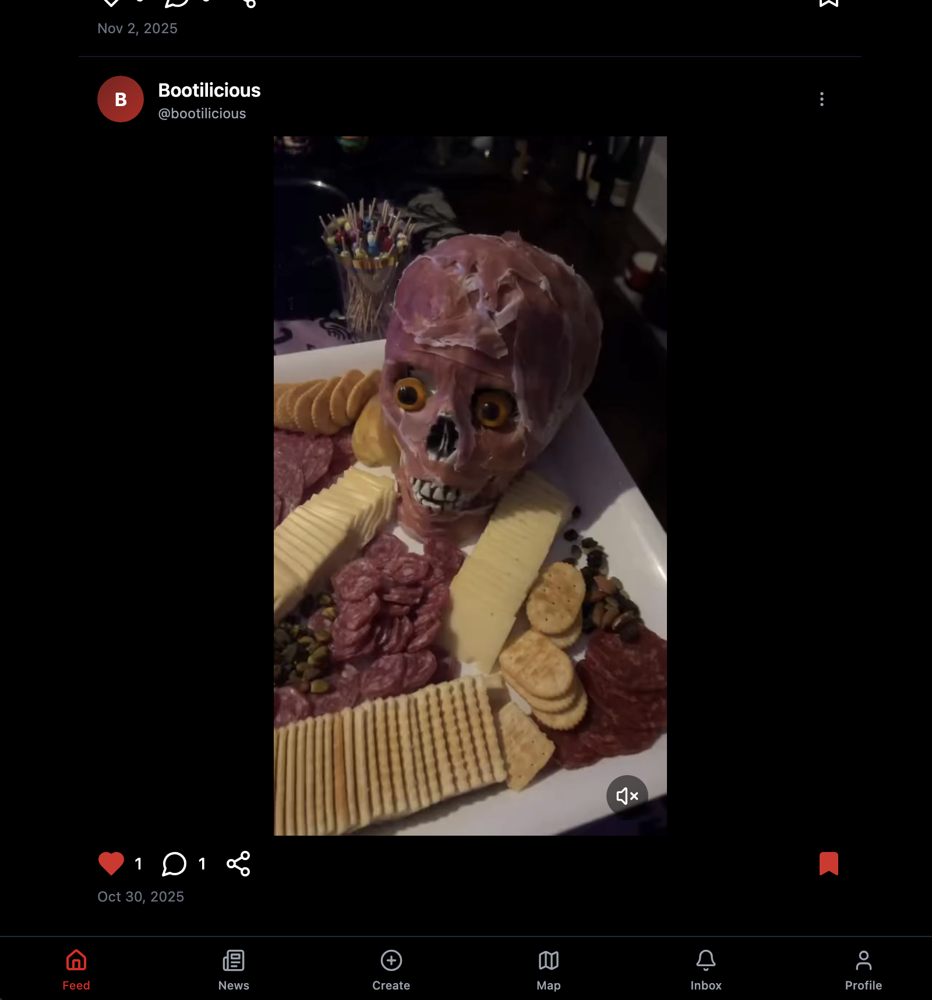
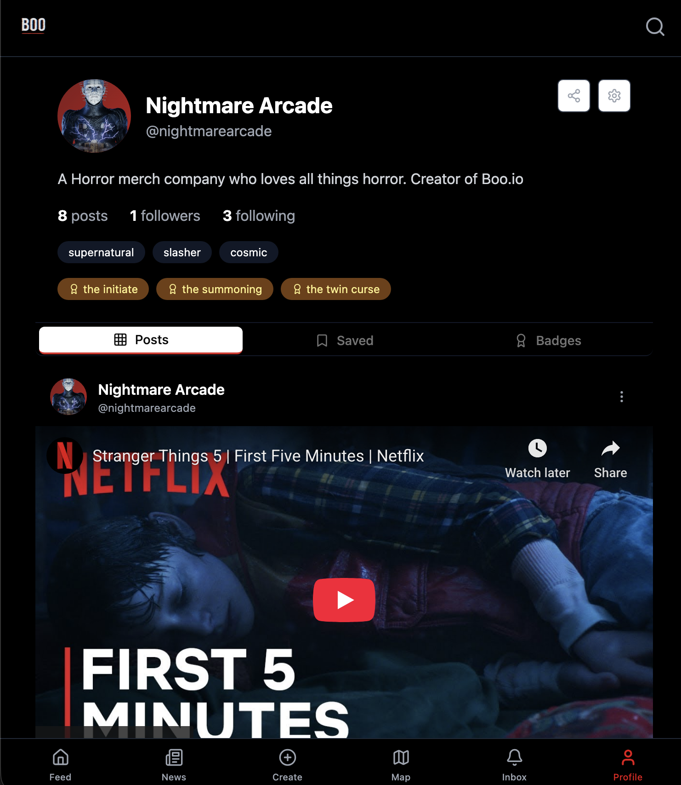
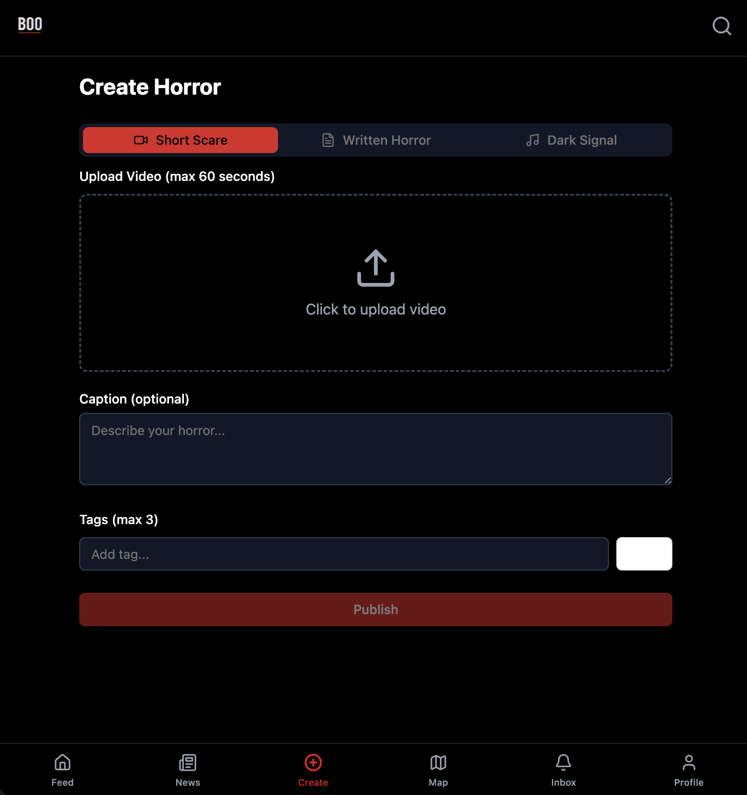
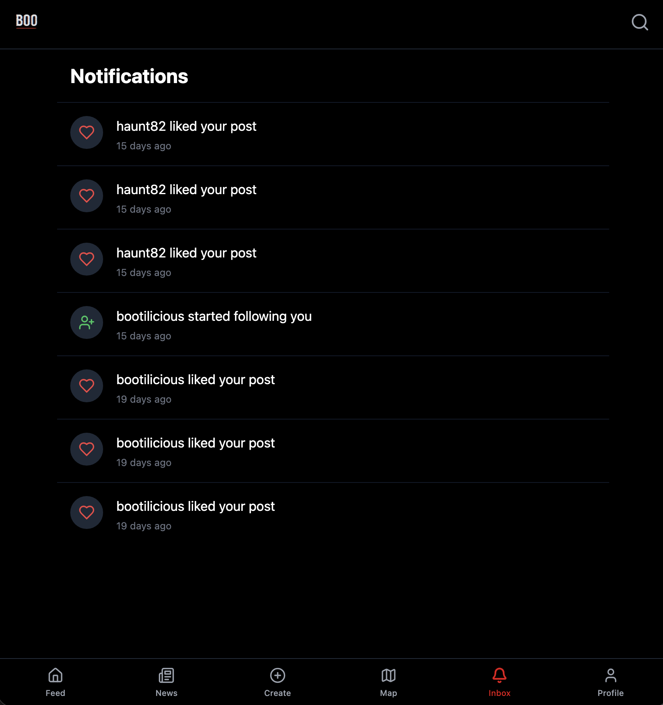
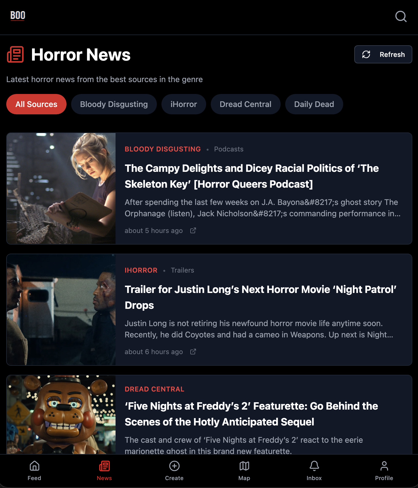
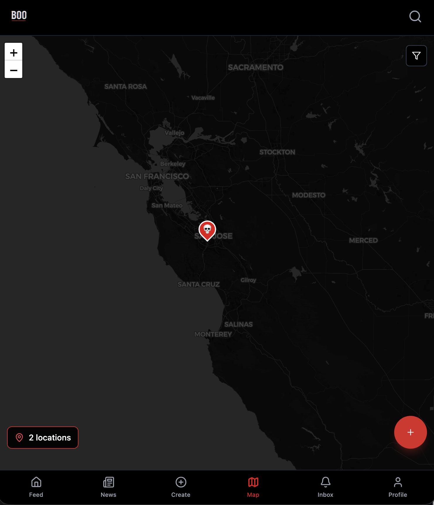
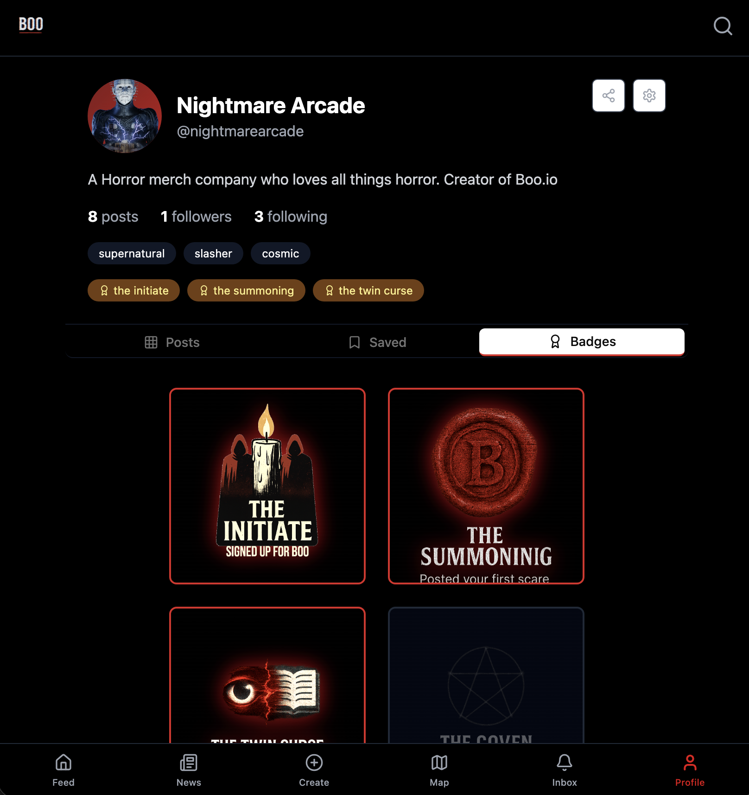

# BOO.io-Showcase

BOO.io is a horror-focused social platform where users create, share, and explore micro-horror content — including videos, stories, original characters, badges, and news — all inside a single immersive horror ecosystem.

## What BOO.io Does
- Users upload original 60-second micro-horror videos
- A personalized horror feed shows recent stories, videos, and updates
- Dynamic badge + achievement system encourages engagement
- Full user profiles with stats, badges, and history
- Community interaction through likes, discussions, and featured content
- Real-time horror news aggregation
- Location-based “Horror Map” highlighting haunted places and cryptid sightings
- Notification center for new followers, badges, and story updates
- Integrated Nightmare Arcade content (games, shirts, characters)

---

## Tech Stack
- **Frontend:** Next.js, React  
- **Backend / API:** Node.js, AWS Lambda, API Gateway  
- **Database:** DynamoDB  
- **Storage:** AWS S3  
- **Auth:** AWS Cognito  
- **Video handling:** AWS Lambda + ffmpeg (if used in your pipeline)  
- **Infrastructure:** Base44 services + custom microservices

---

## My Role
- Founder and product lead  
- Created the BOO.io vision, identity, and horror-focused brand  
- Designed UX flows, UI, core interactions, and content systems  
- Wrote the badge system logic + progression framework  
- Directed engineering, streaming pipelines, and AWS architecture  
- Oversaw QA, testing, and deployment cycles  
- Built community, content strategy, and growth foundation  
- Integrated Nightmare Arcade identity elements throughout the platform  

---

## Screenshots

### Core Experience

  
  
  

### Features & Tools

  
  
  

### Badges

  

---

## Links
- **Website:** https://boonightmare.com  
- **Demo video:** *(Add link if you have one)*  
- **Nightmare Arcade:** https://theNightmareArcade.com  
